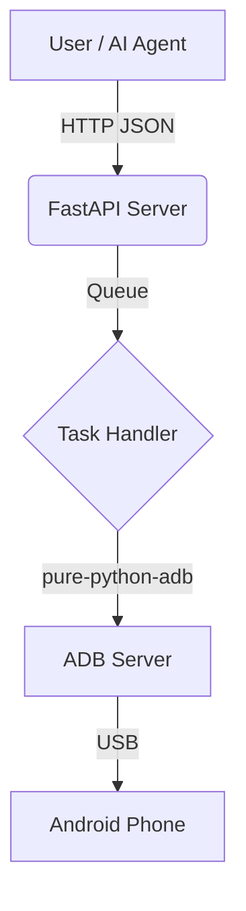

# 🚀 Deployment & Production Recommendations

If you plan to deploy this as a real application or a background service, using raw `subprocess` calls (like we do now) is okay for a Proof of Concept (POC), but for a robust production app, you should use specialized libraries.

Here are the **best packages and technologies** to use for a professional deployment.

---

## 📦 1. Best Python Packages (The "Pro" Stack)

Instead of running shell commands manually, use these Python libraries for better stability and error handling.

### A. Android Control (Replace `subprocess`)
**Recommended Package:** `pure-python-adb`
- **Why:** instead of running `adb.exe` processes every time (which is slow), this library connects directly to the ADB server protocol. It's faster and handles errors better.
- **Install:** `pip install pure-python-adb`
- **Code Example:**
  ```python
  from ppadb.client import Client
  client = Client(host="127.0.0.1", port=5037)
  device = client.device("ZA222MBTV6")
  device.shell("am start -a android.intent.action.SET_ALARM...")
  ```

### B. API Server (Receiver)
**Recommended Package:** `FastAPI` + `Uvicorn`
- **Why:** If you want to send commands from a website, another computer, or an AI agent, you need an API. FastAPI is the modern standard—super fast and gives you automatic documentation.
- **Install:** `pip install fastapi uvicorn`
- **Usage:** Run a local server that accepts JSON and triggers the ADB commands.

### C. Task Queue (For Heavy Load)
**Recommended Package:** `Celery` + `Redis`
- **Why:** If 10 requests come in at once (Set Alarm, Open Note, Send SMS), you don't want them checking the phone at the exact same time. A queue processes them one by one.

---

## 🛠️ 2. Deployment Tools (Making it an App)

How do you give this to a user so they just double-click it?

### A. Create an Executable (.exe)
**Recommended Tool:** `PyInstaller`
- **Why:** Bundles Python, your scripts, and all dependencies into a single `.exe` file. The user doesn't need to install Python.
- **Command:**
  ```bash
  pyinstaller --onefile --noconsole full_automation.py
  ```

### B. Bundling ADB
- **Strategy:** You must bundle `adb.exe` and the DLLs inside your app folder so the user doesn't need to download Android Studio SDK.

---

## 🏗️ 3. Recommended Production Architecture

If you are building a real product (e.g., "AI Desktop Assistant"), structure it like this:



1.  **FastAPI Server**: Runs in background on PC (`localhost:8000`).
2.  **Endpoint**: `POST /execute-task` (Accepts your JSON).
3.  **ADB Client**: Keeps a persistent connection to the phone.

---

## 📊 Summary: The "Perfect" Stack

| Component | Current POC | Production Recommendation |
|:---|:---|:---|
| **ADB Communication** | `subprocess.run("adb...")` | `pure-python-adb` library |
| **Input Method** | Terminal / CLI | `FastAPI` (HTTP Server) |
| **Distribution** | Python Scripts (.py) | `PyInstaller` (.exe) |
| **Concurrency** | One at a time | `AsyncIO` or `Celery` |
| **Logs** | Print statements | `Loguru` (File logging) |

### 💡 Recommendation to Start
If you want to upgrade this existing project:
1.  Keep using **ADB Intents** (they are reliable).
2.  Wrap your `process_task.py` logic in a **FastAPI** server.
3.  Use **PyInstaller** to turn it into a tool you can distribute.
